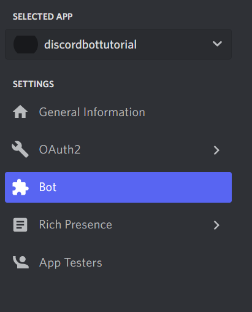
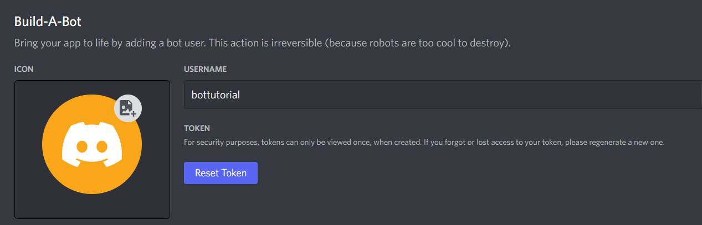
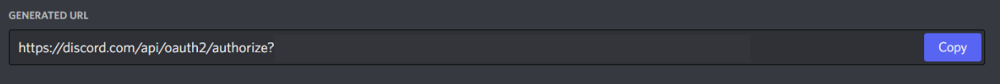

#  Set Up
1. Open your command line and <b>cd</b> into your Discord Bot project.
```bash
$ cd Desktop/DsBotProject
```
2.  Install <b>npm</b>
```bash
$ npm init
```
3. You can also install <a href="https://www.npmjs.com/package//nodemon">nodemon</a> to restart automatically when you make changes in the file.
```bash
$ npm i nodemon
```
4. This is a crucial step to build your Discord bot which is installing <a href="https://discord.js.org/#/">discord.js</a>
```bash
$ npm i discord.js
```
5. Open <a href="https://discord.com/developers/applications">Discord Developer Portal</a> and click on "New Application" button. Name your bot. <br><br>
6. Click on "Bot" button and then add a new bot.<br><br>You will see this page:<br><br><b>(Note : Do not share your token with anyone.</b>)
7. Click on OAuth2 and URL Generator. Go to the <b>Scopes</b> part and select "bot". And then go to the <b>Bot Permissions</b> part and select the buttons shown in the picture.<br><br><br>
8. After that, copy the generated url and paste it into your browser. Select the server you want to add your bot. Then click "Next" and authorize it. If you head over to your server, you will see the bot as offline.<br>
9. Now, you need to copy bot.js and config.json code and paste it inside your project.
10. At last; open your command line, again. Run nodemon bot.js
```bash
$ nodemon bot.js
```
 If you see "Logged in as YourDiscordBot#0000" on the command line, hats off to you! You did it. At the moment your bot is online and responds to your messages.
